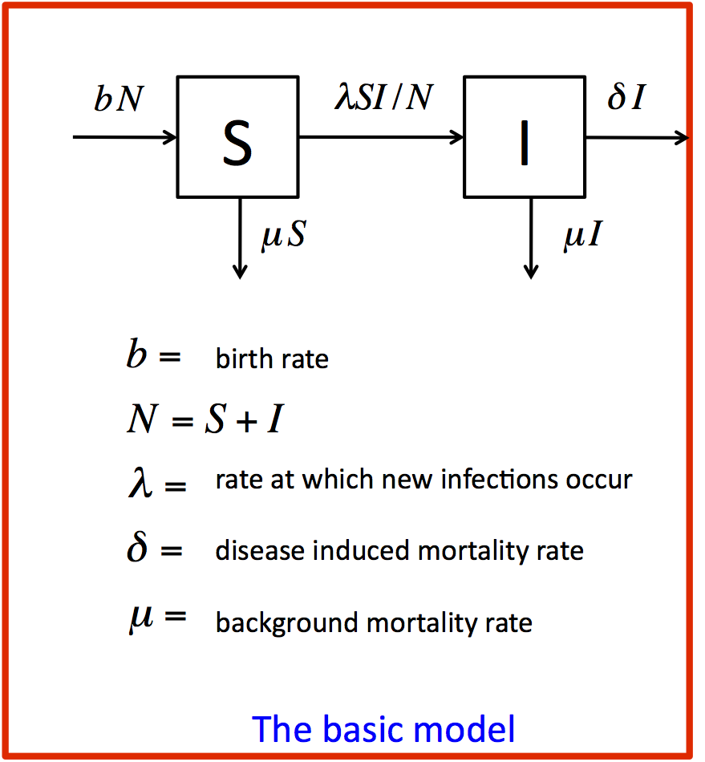

#### Instructions

The basic model structure is shown in the diagram above. You can view/hide the code used to produce the plot or specify the model by toggling the associated **Code** button.

1. Investigate the model structure.
 - Make sure you understand what each of the parameters means.
 - Where in the model code does it show that the instantaneous rate of change of the susceptible compartment is calculated as the total birth rate, minus the _per capita_ background death rate, minus incidence? How would you express this as a differential equation?
 - How is the incidence of infection calculated, and how would you write this as a mathematical expression?
 - Where in the code does it show that the instantaneous rate of change of the infectious compartment is calculated as incidence of infection, minus the background mortality rate, minus the total rate at which infected individuals die of AIDS?
 - How is the total mortality rate for infectious individuals calculated, and how would you write this as a mathematical expression?

2. Run the model and compare the model predictions to ANC data.
 - In the plot to the left, the estimated HIV infection prevalence (based on ANC data) is shown as green points.
 - The model prediction for the trajectory of HIV prevalence is shown in dark green.
 - Visually compare the model prediction to the available data. Does the model do a good job of predicting the data?
 - The model prediction based on the default parameter values and initial conditions is very bad.
 - Try adjusting the parameter values by setting $\lambda$ to 0.4 and 0.6 and by setting the natural log of initial prevalence to be -6 and -9.
 - No matter what values we use for the model parameters, the model prediction does not look like the data: the prevalence is always much too high and the population crashes.
 - Continue to adjust the parameters and initial conditions until you're convinced the model will not fit the data. 

_You can now move on to Model 2._
