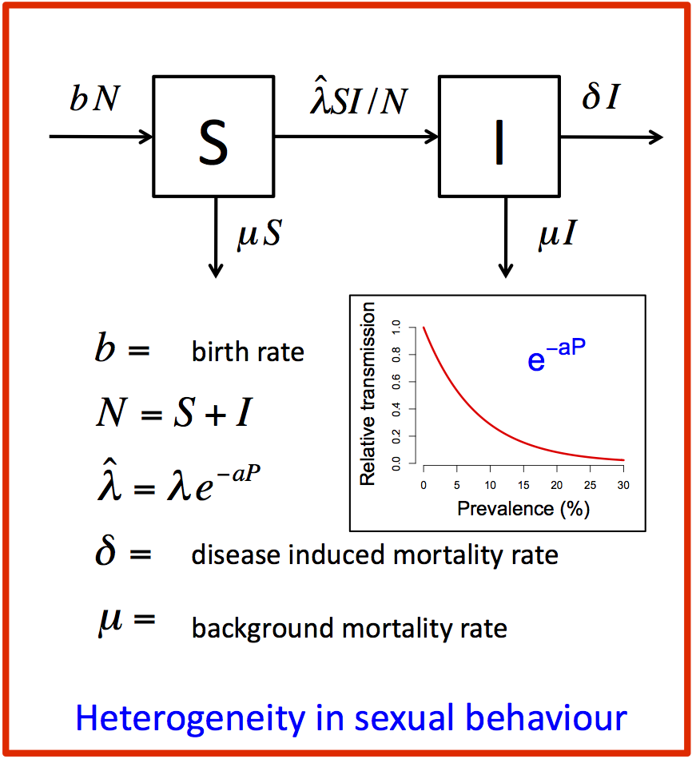

#### Instructions

For Model 1, we found that the prevalence always remained much too high relative to the decline observed in the data. Since some people are likely to have lots of sex, and get infected quickly, while others are likely to have no sex, and never get infected, we may want to modify the model to reflect this heterogeniety in infection risk. There are many ways we could do this, but one of the simplest options -- as described in Jonathan's heterogeneity lecture -- is to define the transmission coefficient as a function of infection prevalence; here, we use the functional form $\hat{\lambda} = \lambda e^{-aP}$, where $a$ is a parameter that determines how rapidly transmisison declines as a function of prevalence and $P = \frac{I}{N}$ is the prevalence of infection.

3. Investigate the new model structure.
- Make sure you understand what each of the parameters means.
- Where in the model code is the hetergeneity represented?
4. Run the model and compare the model predictions to ANC data.
- Visually compare the model prediction to the available data. Does the model do a good job of predicting the data?
- Try adjusting the value of $a$ to see if you can improve the fit.
- We can never get the prevalence curve to peak and then come down.
- Nevertheless, if we set $a$ to about 8, we can bring the prevalence down to about the right level. Do this, and then change the values of $\lambda$ and $b$ to see how well you can fit the initial rise of infection.

Looking at the graph, we see that the mortality precisely follows the trend in prevalence while we know that there should be a delay between the rise in prevalence and the rise in mortality. The reason the mortality curve tracks the prevalence curve is that we have assumed a constant _per capita_ death rate for infected individuals, whereas we know that probability of dying after HIV infection increases with the time since infection. Next, we will modify the model to account for this delay in mortality.

_You can now move on to Model 3._
