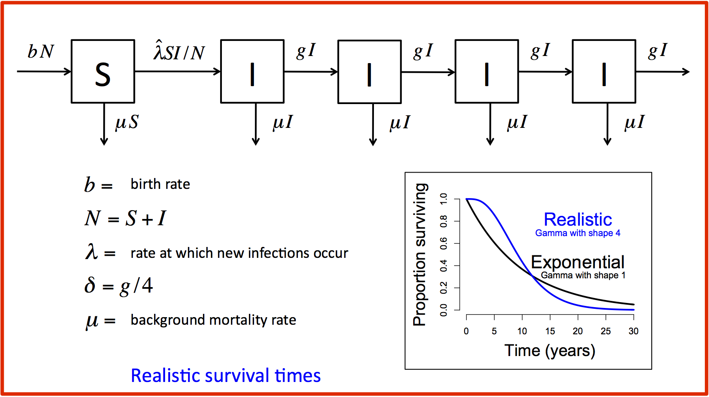

#### Instructions

The easiest way to delay mortality in the model is to modify the way we represent the course of infection. Instead of having a single infected compartment, we can introduce additional compartments that infected individuals must flow through before they can die of AIDS. This changes the survival curve to look much more like the observed survival curve (see the inset on the model diagram figure).

5. Investigate the new model structure.
- Make sure you understand what each of the parameters means. Why do we set $g=4\delta$?
- What is the effect of this delay on the timing of the rise in mortality reltaive to the timing of the rise in prevalence?
6. Run the model and compare the model predictions to ANC data.
- Visually compare the model prediction to the available data. Does the model do a good job of predicting the data?
- Try changing the values of $a$ and $\lambda$ to see how well you can fit the initial rise of infection.

We still cannot fit the decline in prevalence but at least we know that AIDS deaths are not sufficient to bring about the decline. What other real-world processes might need to be added to the model world in order to explain the observed decline in prevalence?
